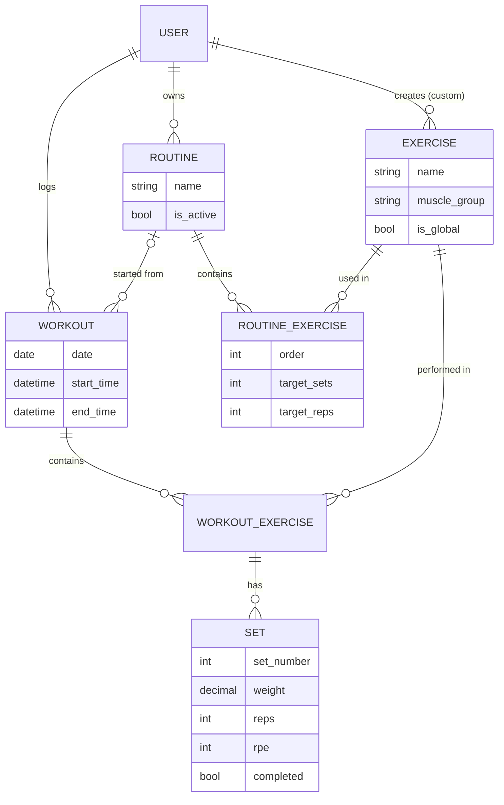

# Gym Tracker API

REST API for planning gym routines and logging real workouts set by set (weight, reps, RPE), so you can see what you trained and how much volume you moved.

It is the backend of a separate web frontend (deployed on Vercel); this API was deployed on Railway with PostgreSQL.

## Features

- **Session authentication with CSRF protection**: register, login, logout, profile and password change, working across two domains (frontend and API).
- **Hybrid exercise catalog**: global exercises loaded by a seed command and visible to everyone, plus custom exercises that only their creator can see and edit.
- **Routines as templates**: ordered exercises with target sets and reps, and a single "active" routine per user.
- **Workout logging**: start a workout from a routine (its exercises are copied) or freestyle, then add sets, finish it, and get duration, total sets and total volume.
- **Filtering and pagination**: search exercises by name, muscle group or global/custom, with paginated responses.
- **Per-user data isolation**: every queryset is scoped to the logged-in user, enforced again by object-level permissions.

## Tech stack

Python 3.12 · Django 6 · Django REST Framework · django-filter · PostgreSQL (production) / SQLite (development) · Gunicorn · WhiteNoise · Docker · Railway

## Data model



- An exercise is either **global** (`created_by` is null) or **custom** (belongs to one user). The model validates both rules on save.
- `RoutineExercise` and `WorkoutExercise` are join tables with extra data (order, targets, notes). The same exercise can't appear twice in a routine or workout.
- Deleting a routine does not delete the workouts started from it: `Workout.routine` is set to null.

## API endpoints

All endpoints except register and login need a valid session cookie. Requests that change data also need the `X-CSRFToken` header.

| Method | Endpoint | Description | Auth |
|---|---|---|---|
| POST | `/api/auth/register` | Create an account and log in | No |
| POST | `/api/auth/login` | Start a session; returns the user and a CSRF token | No |
| GET | `/api/auth/me` | Current user (used by the frontend to restore the session) | Yes |
| GET | `/api/exercises/?muscle_group=chest&search=press` | List global and own custom exercises | Yes |
| POST | `/api/exercises/` | Create a custom exercise | Yes |
| POST | `/api/routines/` | Create a routine | Yes |
| POST | `/api/routines/{id}/exercises/` | Add an exercise with target sets and reps | Yes |
| POST | `/api/routines/{id}/start-workout/` | Create a workout from the routine | Yes |
| POST | `/api/workouts/{id}/exercises/{we_id}/sets/` | Log a set (weight, reps, RPE) | Yes |
| POST | `/api/workouts/{id}/finish/` | Set the end time and close the workout | Yes |

Example response from `GET /api/workouts/1/` after logging one set (some fields removed):

```json
{
  "id": 1,
  "routine_name": "Push Day",
  "date": "2026-10-07",
  "duration": 52,
  "workout_exercises": [
    {
      "id": 1,
      "exercise": { "id": 1, "name": "Bench Press (Barra)", "muscle_group": "chest", "is_global": true },
      "sets": [
        { "set_number": 1, "weight": "80.00", "reps": 8, "rpe": 8, "completed": true, "volume": 640.0 }
      ],
      "total_volume": 640.0
    }
  ],
  "total_volume": 640.0,
  "total_sets": 1,
  "exercise_count": 1
}
```

## Run locally

Requires Python 3.12 or newer (Django 6 does not support older versions).

```bash
git clone https://github.com/ValenBelone7/gym-tracker-api.git
cd gym-tracker-api
python -m venv venv && source venv/bin/activate
pip install -r requirements.txt
cp .env.example .env
# Fill in SECRET_KEY in .env (it can't be empty). To generate one:
python -c "from django.core.management.utils import get_random_secret_key; print(get_random_secret_key())"
python manage.py migrate
python manage.py seed_exercises   # loads 26 global exercises
python manage.py runserver
```

`manage.py` uses `config.settings.development` by default (SQLite, `DEBUG=True`), so `DATABASE_URL` isn't needed locally. The API runs on `http://localhost:8000/api/` and accepts requests from a frontend on `http://localhost:5173`.

## What I learned

- **Cookie sessions across two domains.** The frontend (Vercel) and the API (Railway) are on different domains, so the default cookie settings stopped working after deploying. I had to set `SameSite=None` and `Secure` on the session and CSRF cookies, allow credentials in CORS, add the frontend to `CSRF_TRUSTED_ORIGINS`, and keep the CSRF cookie readable from JavaScript so the frontend can send it back as `X-CSRFToken`. I chose sessions over JWT on purpose: the session cookie is `HttpOnly`, so JavaScript never touches it.
- **One table for global and private data.** Instead of two exercise tables, I used `is_global` plus a nullable `created_by`. Three layers keep it consistent: `Exercise.clean()` checks the invariant, the queryset only returns `is_global=True OR created_by=me`, and a custom `IsOwnerOrGlobal` permission makes global exercises read-only. Routines also check that a custom exercise belongs to the routine's owner.
- **Templates vs. history.** A routine is a plan; a workout is what actually happened. Starting a workout copies the routine's exercises into `WorkoutExercise` rows, so editing or deleting a routine later never changes past workouts. Volume and duration are computed from the sets with database aggregation (`Sum(F('weight') * F('reps'))`), so totals can't drift out of sync with the data.

## Authors

Valentín Belone
